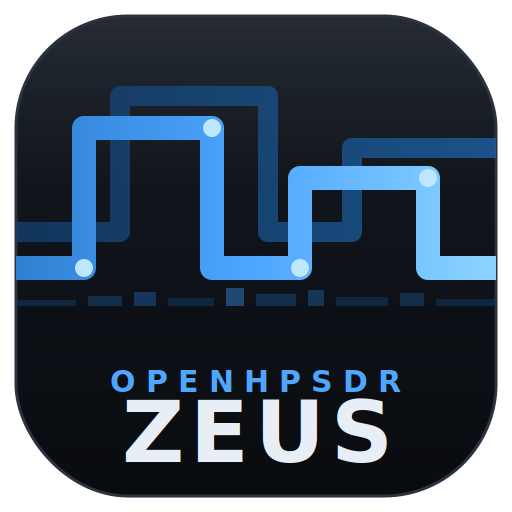

<p align="center">
  
</p>

<h1 align="center">OpenHPSDR Zeus — Community Edition</h1>

<p align="center"><b>The station software for the ANAN G2 Ultra.</b><br/>
A self-updating, browser-based SDR console with next-generation DSP, a neural
CW decoder on the waterfall, and digital voice and beacons built into the
core — developed and bench-verified on G2 Ultra hardware, end to end.</p>

---

## What this is

This is the actively developed community fork of OpenHPSDR Zeus, built
**specifically for the ANAN G2 Ultra**: the radio's Raspberry Pi 5, its
8-inch 1280×800 front panel, its dual phase-coherent ADCs, and its
Protocol-2 / Saturn architecture are the reference platform for every
feature and every fix. Development happens in live deploy-test-patch cycles
on real G2 Ultra hardware; field photos are the arbiter of truth.

Other OpenHPSDR radios (Hermes Lite 2 and Protocol-1 boards, earlier ANANs)
inherit the upstream support they had and generally keep working, but the
G2 Ultra is where this fork is aimed, tuned, and tested.

## Install (G2 Ultra / Raspberry Pi 5)

One command on a fresh Raspberry Pi OS, as the operator account:

```sh
wget https://raw.githubusercontent.com/abhishekprakash22/zeus/freedv-in-core/installers/factory-install.sh
chmod +x factory-install.sh && ./factory-install.sh
```

This fetches the latest release, verifies its sha256 against the update
manifest, installs to a stable path, writes the Desktop launcher, and
enables a supervising systemd user service. **After that, Zeus updates
itself**: Settings → Updates → *INSTALL & RESTART* downloads, verifies,
swaps, and restarts in place — with automatic rollback to the previous
version if a new build fails to come up.

Prefer manual? Grab the arm64 AppImage from
[Releases](../../releases/latest), `chmod +x`, run.

## Highlights

**DSP — WDSP 2.0, fully open.** The modernized WDSP 2.0 core at engine
parity: RNNoise neural noise reduction (NR3), NR4/SBNR spectral
subtraction, drawable RX/TX EQ, the CFC compressor suite, phase-rotator
auto mode, WBFM stereo, modernized PureSignal.

**A receiver that thinks ahead.** Predictive S-ATT adds the smallest whole
decibel of attenuation *before* the ADC clips (Protocol-2 raw-peak
telemetry, zoned hysteresis, no pumping). Smart NR judges only what's
inside your filter, and weak-signal evidence accumulates so faint
persistent carriers earn recognition. All switchable.

**DeepCW — Morse, read by a neural network.** One press and the tuned
signal's CW streams as text: in a transcript window, in a callout pinned
to the signal, and as characters riding down the waterfall. Press *SKIM*
and the Pi decodes **every CW signal in the passband concurrently** — one
lane per station at its true frequency, tap a lane to tune there.
Bench-verified on real 40 m QSOs at under half the Pi 5's CPU.

**Digital modes in the core.** FreeDV 700D/700E digital voice, a full WSPR
receive pipeline plus an autonomous beacon, and the FT8/FT4 suite — no
virtual audio cables, no companion apps.

**Diversity, touchable.** The G2 Ultra's two phase-coherent ADCs combine
under one draggable point on a polar pad: steer the null, watch local
noise vanish, save four null memories with glide recall.

**Made for the G2 Ultra's screen.** Setup Mode pins the workspace to the
panel and lets you hand-arrange tiles; every tile carries a ⧉ button that
sends it to a second monitor; layouts persist per radio; and the display
pipeline was chosen by measurement on the Pi 5's GPU.

**Operating aids.** True dual-receive SPLIT (VFO B *is* RX2), RIT with a
live offset chip, four receivers, remote operation through a self-hosted
single-file relay.

**An appliance that maintains itself.** One-button verified updates with
rollback, a self-healing Desktop shortcut, honest version reporting, and a
factory provisioning script for golden images.

## Heritage & thanks

Zeus was created by **Brian Keating, EI6LF**, whose architecture and
copyright this fork preserves throughout, and it stands on the shoulders
of the OpenHPSDR community: **Warren Pratt (WDSP)**, **David Rowe
(Codec2/FreeDV)**, **K9AN (WSPR)**, the **e04 DeepCW engine**
(AGPL-3.0, combined per GPLv3 §13 — see `zeus-web/public/deepcw/NOTICE.txt`),
and Thetis, from which much of the DSP lineage flows. The name honors that
lineage: Zeus, from Thetis.

## Roadmap

Auto-notch from the stationarity map · WSPRnet upload + map · SKIM as the
primary CW decoder · RADE and FreeDV Reporter · diversity auto-null servo ·
Vulkan display backend.

## License

GPL-2.0-or-later throughout. Engine, server, and client in one tree —
no binary blobs, no closed components.

*73, and see you in the pileup.*
